## 1.0 Introduction 

With the rise of high-resolution cameras, smartphones, and advanced imaging technologies, the number and size of photos we take have increased significantly. This has made storing and sharing images a greater challenge. To address this issue, image compression—especially lossy compression—has become a crucial solution. It reduces the file size of pictures without noticeably affecting their visual quality. 

JPEG, which stands for Joint Photographic Experts Group, is one of the most popular lossy image compression standards. It is widely used because it can achieve very high compression rates while maintaining such a minimal loss in quality that it is usually imperceptible. This makes JPEG ideal for various applications, such as digital photography, web graphics, and even medical imaging. 

JPEG compression combines several techniques, including the Discrete Cosine Transform (DCT), Run-Length Encoding, and Huffman Encoding. The goal of JPEG compression is to analyze the image pixels and remove elements that are less noticeable to the human eye, particularly high-frequency changes that are harder to perceive. 

### 1.1 Problem Statement 

Digital media have grown very quickly, and the need for high-resolution images has made managing image data challenging. High-resolution images take up a lot of storage space and require large bandwidth for transmission, creating significant pressure on storage systems, networks, and processing technologies. Traditional lossless compression methods, while great at preserving image quality, often cannot achieve the high level of compression needed for modern applications. 

The main challenge is finding a balance between compressing the image effectively and keeping it visually clear. Lossy compression methods, like JPEG, tackle this by removing parts of the image data that are less important to human perception. JPEG uses the DCT (Discrete Cosine Transform) to convert image data into frequency components and then applies techniques like run-length and Huffman encoding to compress the data efficiently. This project explores how JPEG compression, using DCT, run-length 

encoding, and Huffman encoding, achieves both goals: reducing file size and keeping images visually appealing. 

## 2.0 Literature Review 

### 2.1 Lossy vs Lossless Image Compression 

Lossy and lossless compression are two common methods used to reduce the size of image files. In lossless compression, the image is compressed in such a way that, when decompressed, it perfectly matches the original image. No data is lost in the process, making this method ideal for situations where preserving every detail is essential, such as medical imaging or technical drawings. Examples of lossless compression methods include PNG and GIF file formats. 

In contrast, lossy compression, like the kind used in JPEG, reduces file size by permanently removing some data from the image. This process involves eliminating details that are less noticeable to the human eye. As a result, when the image is decompressed, it does not fully recover the original data, and there may be a slight reduction in quality. However, the reduction in file size is much greater compared to lossless methods, making lossy compression more suitable for applications like web graphics, social media, and general photography. 

### 2.2 Why Convert RGB Color Space to YCbCr? 

The human eye has two types of light-sensitive cells: rods and cones. Rods, which are not sensitive to color, are crucial for vision in low light, while cones are responsible for color vision, with receptors sensitive to red, green, and blue light. Each eye contains about 100 million rod cells, but only 6 million cone cells, which means the human eye is much more sensitive to changes in brightness and darkness (luminance) than to changes in color (chrominance). 

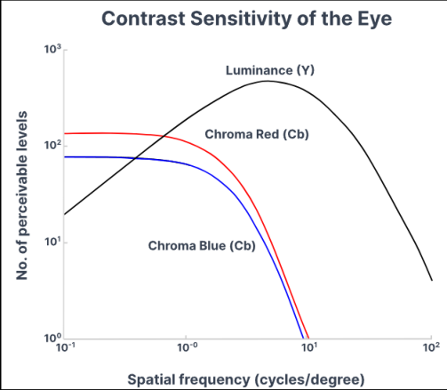

Figure 2.1: Contrast Sensitivity of the Eye 

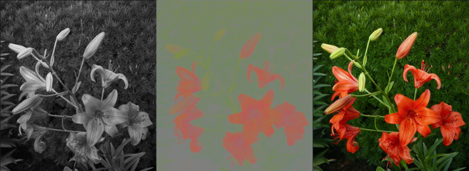

Figure 2.2: The image on the left represents luminance, the image in the center represents chrominance, and the image on the right is the original image. 

JPEG compression takes advantage of this by converting the RGB color model to the YCbCr color model, which separates luminance (Y) from chrominance (Cb and Cr). This separation allows for chroma subsampling, or downsampling, which reduces the amount of chrominance data stored without significantly affecting the perceived image quality. 

### 2.3 What is DCT? 

Human vision is less sensitive to high-frequency changes in an image, such as rapid variations in pixel values. Therefore, we can discard or reduce the contribution of high-frequency components while still preserving the perceptual quality of the image. 

The Discrete Cosine Transform (DCT) represents image data as the sum of cosine waves with varying frequencies. 

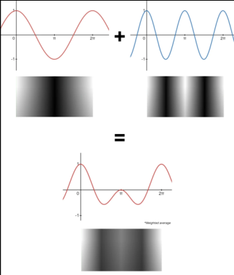

Figure 2.3: Two cosine waves combine to form more complex cosine waves, which can then represent a much more intricate image. 

In JPEG compression, a set of 64 cosine basis functions is used to transform 8x8 pixel blocks. These basic functions cover a range of frequencies, with higher horizontal frequencies increasing as you move from left to right and higher vertical frequencies increasing as you move from top to bottom within each block. 

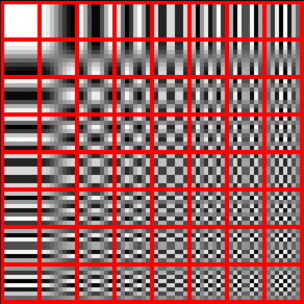

Figure 2.4: 64 different cosine wave 

The purpose of calculating Discrete Cosine Transform (DCT) coefficients is to understand how different frequencies make up an image. This process breaks the image down into patterns, from smooth, flat areas 

(low frequencies) to sharp details like edges (high frequencies). The DCT coefficients in the top-left corner are usually higher because they represent the low-frequency parts, which make up the general shape of the image. On the other hand, the coefficients in the bottom-right corner are lower and represent the high-frequency details, like sharp edges and fine textures. 

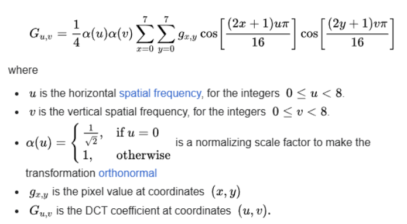

Figure 2.5: Formula for Calculating the 2D-DCT Coefficients 

### 2.3 Why Quantization? 

Quantization is used to reduce the precision of the DCT coefficients by dividing them by quantization values and rounding them to integers. This process helps compress the image by selectively reducing the impact of high-frequency elements, which are often found in the lower-right corner of the block. These high-frequency components, typically representing fine details like edges and textures, are less noticeable to the human eye. As a result, they can be simplified or reduced to zero without causing a significant loss in visual quality. By doing this, we create more trailing zeros, which can then be efficiently compressed using techniques like run-length encoding. This further reduces the file size while preserving the essential features of the image. 

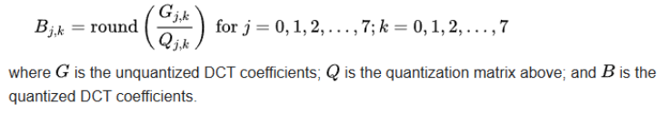

Figure 2.6: Formula for Quantization 

### 2.4 What is Run-Length Encoding? 

Run-length encoding (RLE) is a compression technique that replaces consecutive repeated values in a data sequence with a pair: the value and how many times it repeats. The format is typically written as **(Quantized DCT Coefficient value, Frequency)** . 

In the context of JPEG compression, quantized coefficients can be encoded using RLE, where sequences of zeros are replaced by a count of how many zeros appear. This step further reduces the data size, especially when there are long runs of zeros or similar values after quantization. For example, if a sequence of quantized coefficients contains many consecutive zeros, RLE would encode this as a single value representing the number of zeros, rather than storing each zero individually. 

### 2.5 What is Huffman Encoding? 

Huffman encoding is a compression technique that further reduces the data size by assigning shorter codes to more frequently occurring values and longer codes to less frequent ones. The process begins by creating a frequency table that shows how often each quantized coefficient appears. 

Huffman encoding works by building a binary tree where each leaf node represents a coefficient, and the frequency of that coefficient determines its position in the tree. The tree is created by pairing the two least frequent values from right to left and repeating the process until all nodes are connected in a single tree The tree is constructed in such a way that coefficients with higher frequencies are closer to the root, meaning they are assigned shorter binary codes. On the other hand, less frequent coefficients are placed further from the root, resulting in longer binary codes. 

### 2.6 Conclusion 

In JPEG compression, the DCT transforms the image into the frequency domain, separating important low-frequency components from less important high-frequency ones. This helps reduce the amount of data needed to represent the image. After the DCT, Run-Length Encoding (RLE) is applied, followed by Huffman Coding, to eliminate redundancy and further compress the data. Together, these techniques enable JPEG to achieve high compression ratios while maintaining little to no loss in image quality. 

## 3.0 Methodology 

### 3.1 JPEG Compression Pipeline - High Overview 

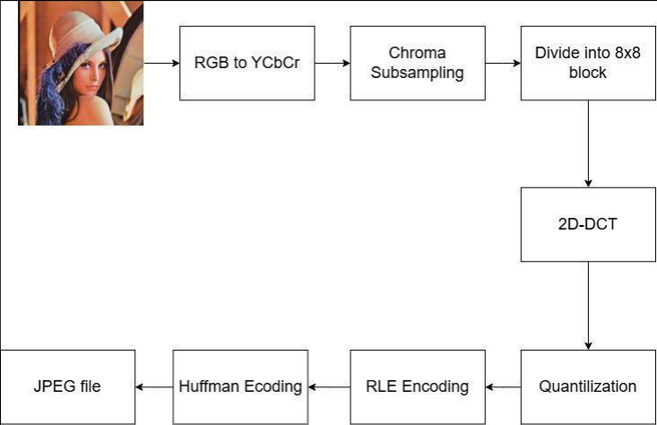

Figure 3.1: High Overview of JPEG Compression Pipeline 

### 3.2 Color Transformation: RGB to YCbCr 

The RGB color model is the standard way to represent colors in digital images. Each pixel in this model is made up of three color channels: red, green, and blue. The value of each channel can range from 0 to 255, using 8 bits (1 byte) of data per channel. This gives 256 possible intensity levels for each color. By combining the values of the red, green, and blue channels, the final color of a pixel is created. Since each pixel uses 3 bytes of data (one for each channel), the RGB model requires a total of 3 bytes per pixel. 

The conversion from RGB to YCbCr is a lossless color space transformation that preserves all original image information (which means the process is reversible). This process takes the RGB values of each pixel and mathematically transforms them into three new components: 

1. Y (Luminance): Represents the brightness or grayscale information of the pixel. 

2. Cb (Blue Chrominance): Quantifies the difference between the blue channel and the luminance. 

3. Cr (Red Chrominance): Quantifies the difference between the red channel and the luminance. 

The formula for converting RGB to YCbCr is as follows: 

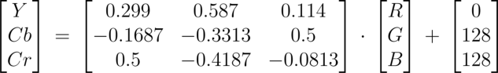

Note: During conversion, the Cb (blue chrominance) and Cr (red chrominance) values can become negative. To avoid this, 128 is added to both Cb and Cr, shifting their range from [−128, 127] to [0, 255]. 

Given R = 81, G = 35, B = 0 

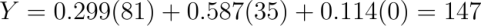

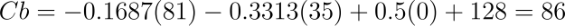

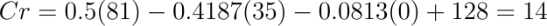

### 3.3 Chroma Subsampling 

Human eyes are more sensitive to brightness (luminance, represented by the Y channel) than color (chrominance, represented by the Cb and Cr channels). Chroma subsampling reduces the resolution of the chrominance channels (Cb and Cr) because we don't notice the loss of detail as much. In chroma subsampling, the Y channel (brightness) remains the same, but the Cb and Cr channels are sampled at lower resolutions which can reduce the file size. 

Below are some commonly used subsampling ratios for JPEG images: 

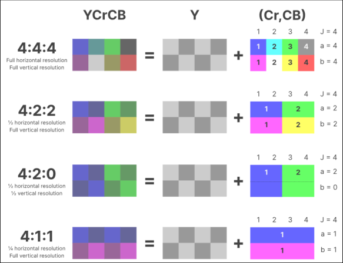

Figure 3.2: Different subsampling ratio for JPEG 

The difference between chroma downsampling and chroma subsampling is how the shared chroma value is chosen. In the 4:2:0 chroma downsampling method, an 8x8 image is divided into 2x2 blocks, and the chroma value for each block is found by averaging the values of the four pixels in that block. On the other hand, chroma subsampling also uses a 2x2 block but instead of averaging, it picks one pixel—usually the top-left pixel—to represent the chroma value for the whole block. 

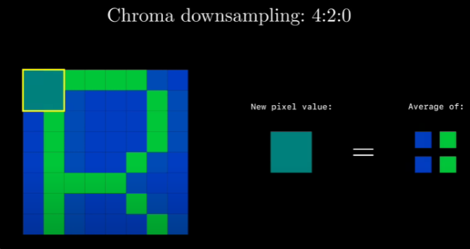

Figure 3.3: Chroma downsampling 

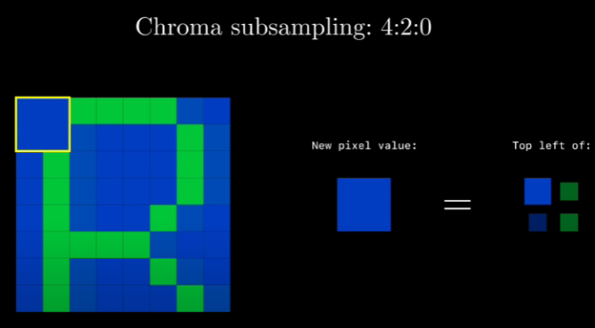

Figure 3.4: Chroma subsampling 

### 3.4 Block Splitting 

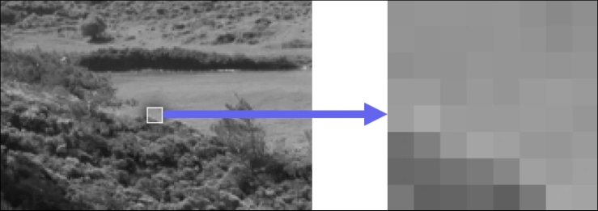

Figure 3.5: Image is divided into 8x8 pixel blocks 

The entire image is divided into non-overlapping 8x8 pixel blocks. Each block contains 64 pixels with luminance values ranging from 0 to 255. 

### 3.5 2D Discrete Cosine Transform (2D-DCT) 

#### **Step 1: Convert the image to Y, Cb, and Cr values, with each ranging from 0 to 255.** 

Note: In this example, we are only showing the Y component (luminance), but the same process applies to the Cb and Cr components (chrominance). 

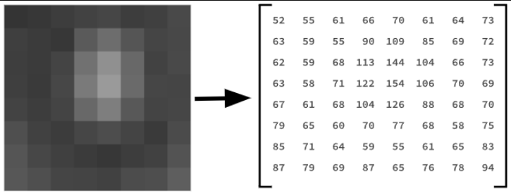

Figure 3.6: Convert Image to Y, Cb and Cr values 

#### **Step 2: Value Shifting (Recenter Around Zero)** 

Each pixel value is shifted by subtracting 128, transforming the range from [0,255] to -[128, 127] 

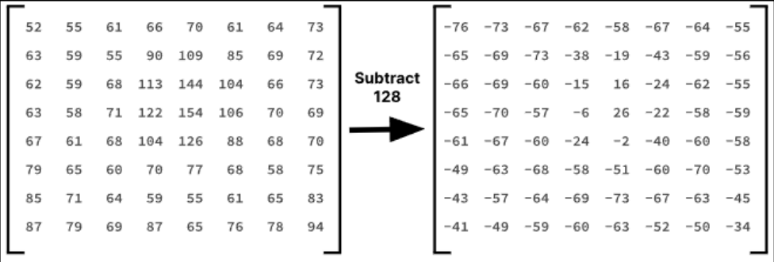

Figure 3.7: Subtracting Pixel intensity by 128 

**Step 3: Apply 2D-DCT to compute DCT Coefficient** 

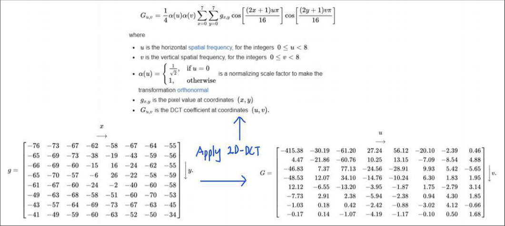

Figure 3.8 Apply 2D-DCT 

### 3.6 Quantization 

A quantization table is applied to DCT coefficients. Critically, this table is deliberately designed with larger values in the lower-right corner, corresponding to high-frequency components that human eyes struggle to perceive. 

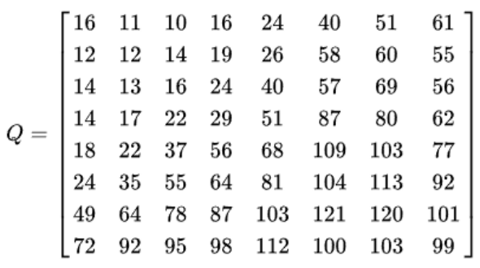

Figure 3.9 : Quantization table with quality of 50  for Luminance 

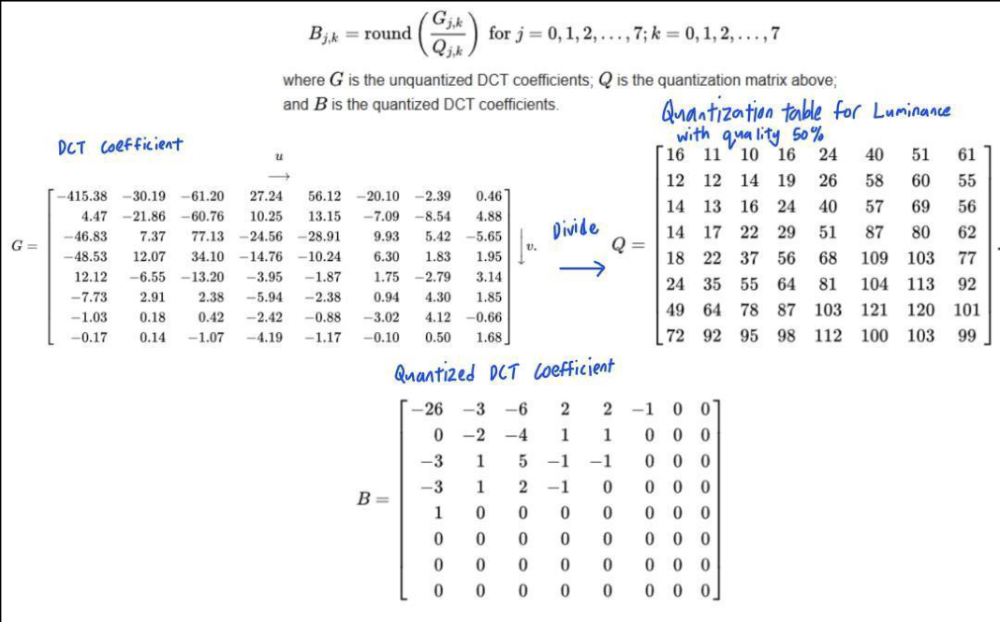

Figure 3.10 : Apply Quantization 

How does the value -26 come about? By simply dividing the DCT coefficients by the corresponding values in the quantization table and rounding to the nearest integer, we get -26. 

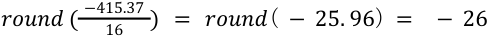

### 3.7 Zig Zag 

Order the Quantized DCT Coefficient in Zigzag Order 

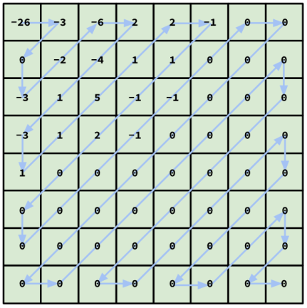

Figure 3.11: Quantized DCT Coefficient in Zigzag Order 

Result: 

[-26 -3 0 -3 -2 -6 2 -4 1 -3 1 1 5 1 2 -1 1 -1 2 0 0 0 0 0 -1 -1 0 0 0 0 0 0 0 0 0 0 0 0 0 0 0 0 0 0 0 0 0 0 0 0 0 0 0 0 0 0 0 0 0 0 0 0 0 0  ] 

### 3.8 RLE Encoding 

Turn the Zig Zag Quantized DCT Coefficient to ( **Quantized DCT Coefficient value, Frequency)** Format **.** 

Zig Zag Quantized DCT Coefficient: 

[-26 -3 0 -3 -2 -6 2 -4 1 -3 1 1 5 1 2 -1 1 -1 2 0 0 0 0 0 -1 -1 0 0 0 0 0 0 0 0 0 0 0 0 0 0 0 0 0 0 0 0 0 0 0 0 0 0 0 0 0 0 0 0 0 0 0 0 0 0] 

Start with the first value -26 and count its frequency (1 occurrence). Continue to the next value -3 and count its frequency. Repeat for all other values in the array. 

Run-length encoded: 

[(-26, 1), (-3, 1), (0, 1), (-3, 1), (-2, 1), (-6, 1), (2, 1), (-4, 1), (1, 1), (-3, 1), (1, 2), (5, 1), (1, 1), (2, 1), (-1, 1), (1, 1), (-1, 1), (2, 1), (0, 5), (-1, 2), (0, 38)] 

### 3.9 Huffman Encoding 

#### Step 1: Build a Frequency Table 

Table 3.1 : Frequency Table For Quantized DCT Coefficient 

|Quantized DCT Coefficient|Frequency|
|---|---|
|-26|1|
|-2|1|
|-6|1|
|-4|1|
|5|1|
|-3|3|
|2|3|
|-1|4|
|1|5|
|0|44|

Step 2: Construct Huffman Tree 

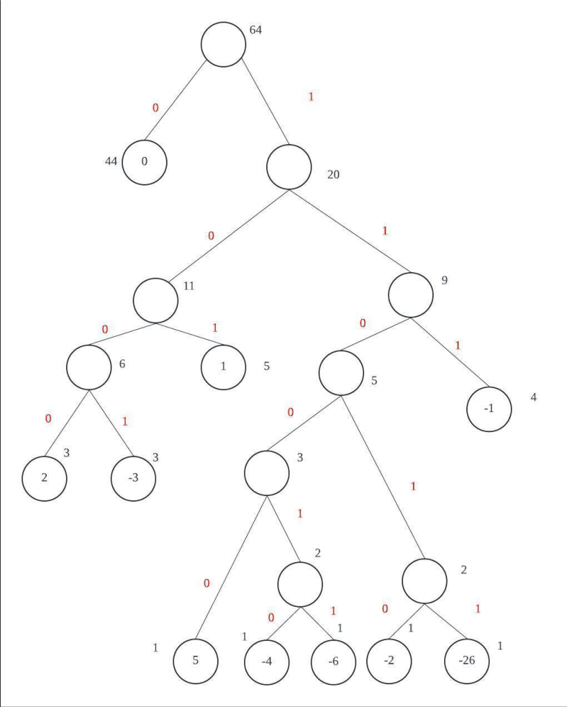

Figure 3.12: Huffman Tree 

#### Step 3: Building Huffman Table 

Table 3.2 : Binary Code Table For Quantized DCT Coefficient 

|Quantized DCT Coefficient|Binary Code|
|---|---|
|0|0|
|1|101|
|-1|111|
|2|1000|
|-3|1001|
|5|11000|
|-2|11010|
|-26|11011|
|-4|110010|
|-6|110011|

#### Step 4: Generate Huffman Code 

RLE Encoded Code: 

[(-26, 1), (-3, 1), (0, 1), (-3, 1), (-2, 1), (-6, 1), (2, 1), (-4, 1), (1, 1), (-3, 1), (1, 2), (5, 1), (1, 1), (2, 1), (-1, 1), (1, 1), (-1, 1), (2, 1), (0, 5), (-1, 2), (0, 38)] 

##### Huffman Code: 

11011 , 1001 , 0 , 1001 , 11010 , 110011 , 1000 , 110010 , 101 , 1001 , 101 , 101 , 11000 , 101 , 1000 , 111 , 101 , 111 , 1000 , 0 , 0 , 0 , 0 , 0 , 111 , 111 , 0 , 0 , 0 , 0 , 0 , 0 , 0 , 0 , 0 , 0 , 0 , 0 , 0 , 0 , 0 , 0 , 0 , 0 , 0 , 0 , 0 , 0 , 0 , 0 , 0 , 0 , 0 , 0 , 0 , 0 , 0 , 0 , 0 , 0 , 0 , 0 , 0 , 0 

Concatenated Huffman Code: 

110111001010011101011001110001100101011001101101110001011000111101111100000000111111000 00000000000000000000000000000000000 

## 3.10 Calculating the Compression Rate 

##### **Zig Zag Quantized DCT Coefficient:** 

[-26 -3 0 -3 -2 -6 2 -4 1 -3 1 1 5 1 2 -1 1 -1 2 0 0 0 0 0 -1 -1 0 0 0 0 0 0 0 0 0 0 0 0 0 0 0 0 0 0 0 0 0 0 0 0 0 0 0 0 0 0 0 0 0 0 0 0 0 0] 

64 number x 8 bits = **512 bits** 

##### **RLE Encoded Code:** 

[(-26, 1), (-3, 1), (0, 1), (-3, 1), (-2, 1), (-6, 1), (2, 1), (-4, 1), (1, 1), (-3, 1), (1, 2), (5, 1), 

(1, 1), (2, 1), (-1, 1), (1, 1), (-1, 1), (2, 1), (0, 5), (-1, 2), (0, 38)] 

21 pair x ( 8 bits (first num in pair) + [6|7|8] bits (second num in pair) ) 

= 21 pair x 14 bits 

= **294 bits** 

##### **Huffman Code:** 

11011 , 1001 , 0 , 1001 , 11010 , 110011 , 1000 , 110010 , 101 , 1001 , 101 , 101 , 11000 , 101 , 1000 , 111 , 101 , 111 , 1000 , 0 , 0 , 0 , 0 , 0 , 111 , 111 , 0 , 0 , 0 , 0 , 0 , 0 , 0 , 0 , 0 , 0 , 0 , 0 , 0 , 0 , 0 , 0 , 0 , 0 , 0 , 0 , 0 , 0 , 0 , 0 , 0 , 0 , 0 , 0 , 0 , 0 , 0 , 0 , 0 , 0 , 0 , 0 , 0 , 0 

**122 bits** 

##### **Frequency Table:** 

|Quantized DCT Coefficient|Binary Code|
|---|---|
|0|0|
|1|101|
|-1|111|
|2|1000|
|-3|1001|
|5|11000|
|-2|11010|
|-26|11011|
|-4|110010|
|-6|110011|

Per Coefficient: 8 bits(for the coefficient) + 6-bit code = 14 bits. 

Entire Table (10 entries): 10 entries × 14  bits = **140 bits** 

##### **Huffman Code + Frequency Table: 122 + 140 bits = 262 bits** 

The original zig-zag quantized DCT coefficients consist of 64 values, each represented by 8 bits, resulting in a total size of 512 bits. Using Run-Length Encoding (RLE), the data is compressed by grouping consecutive zeros and representing them with a count alongside each non-zero value and its frequency. In this example, the 64 coefficients are reduced to 21 pairs, with each pair requiring approximately 14 bits (8 

bits for the value and 6 bits for the frequency). This reduces the total size to 294 bits, effectively eliminating the need to store long runs of zeros and reducing the data by about 43%. 

Further compression is achieved with Huffman encoding, which assigns shorter binary codes to frequently occurring values and longer codes to less frequent ones based on their frequency distribution. This process reduces the RLE-encoded data from 294 bits to 262 bits, as calculated earlier by combining the size of the Huffman-coded data (122 bits) with the size of the frequency table (140 bits). This achieves a further reduction in size compared to the RLE encoding alone, providing an overall compression ratio of approximately 49% compared to the original size of 512 bits. 

## 3.11 Compressed Bin Format 

The compressed result is stored in a custom binary format created by me. Below is the structure of the file header for the compressed binary format: 

Table 3.3 : File Header for Compressed Data 

|Dimension||Size(Leng of Data|th)|Compress Data (Encoded Huffman String)|Size(Length) of Frequency Dictionary|Frequency D|ictionary|||||
|---|---|---|---|---|---|---|---|---|---|---|---|
|Y Cb|Cr|Y Cb|Cr|Y Cb Cr|Y Cb Cr|Y||Cb||Cr||
|ro w col ro w|col ro w co l|||||Coefficient|frequency|Coefficient|frequency|Coefficient|frequency|

# **<u>Final (Result) Report (Part B)</u>** 

## 1.0 Results & Performance Measurement 

### 1.1 Input Image 

Figure 1.1: Original Image 

Figure 2.1 illustrates the original image used as input for the program, with dimensions of 8192 x 8192 pixels. 

### 1.2 Encoding Performance Gains 

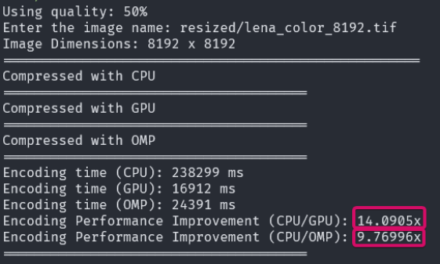

Figure 1.2: Encoding gain 

The Performance Gain is Calculated by the following formula: 

<u>Performance gain = Original Execution Time / Modified Execution Time</u> 

In Figure 2.2, CUDA demonstrates an encoding speedup of 14.09 times compared to the CPU, while OMP shows a speedup of 9.77 times compared to the CPU. 

### 1.3 Compression Ratio 

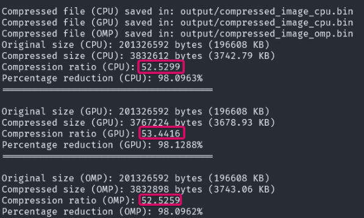

Figure 1.3: Compression Ratio and Percentage Reduction 

The Compression Ratio is Calculated by the following formula: 

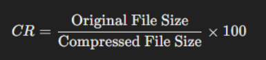

As illustrated in Figure 2.3, all methods—CPU, GPU (CUDA), and OMP—achieved a similar compression ratio of approximately 52–53, significantly reducing the file size. 

### 1.4 Decoding Gains 

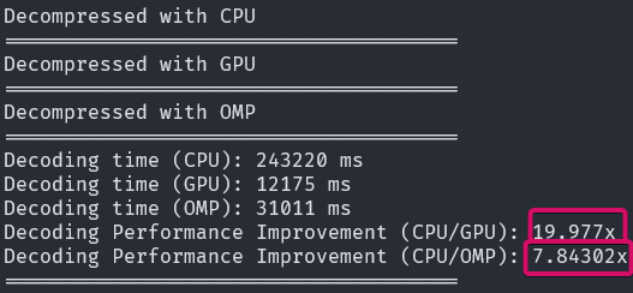

Figure 1.4: Decoding gain 

The Performance Gain is Calculated by the following formula: 

<u>Performance gain = Original Execution Time / Modified Execution Time</u> 

In Figure 2.2, CUDA demonstrates an encoding speedup of 19.98 times compared to the CPU, while OMP shows a speedup of 7.84 times compared to the CPU. 

### 1.5 Image Metric 

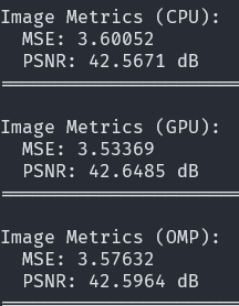

Figure 1.5: Image Metric (MSE and PSNR) 

The Mean Square Error is Calculated by the following formula: 

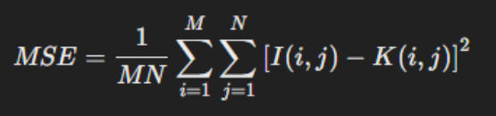

The PSNR is Calculated by the following formula: 

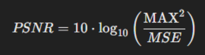

The mean square error (MSE) for all methods is calculated to be in the range of 3.5 to 3.6, while the peak signal-to-noise ratio (PSNR) is approximately 42.5 dB. This indicates that the decompressed image closely resembles the original image with minimal loss in quality. 

In the context of JPEG compression and decompression, a lower MSE (closer to 0) and a higher PSNR (typically above 30 dB) are generally considered indicators of good quality. For high-quality compression, PSNR values above 40 dB, as seen in this case, suggest excellent retention of image details with minimal visible artifacts. 

### 1.6 Output Result 

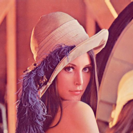

Figure 1.6: Decompressed Image using CPU 

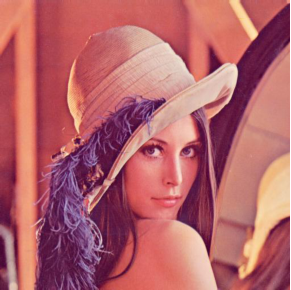

Figure 1.7: Decompressed Image using CUDA 

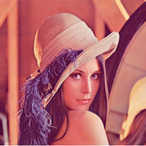

Figure 1.8: Decompressed Image using OMP 

## 2.0 Comparison Performance Between CUDA and OMP 

For this comparison between CUDA and OMP, we analyzed encoding gains, decoding gains, compression ratios, MSE, and PSNR using the Lena image, ranging in size from 512×512 px to 8192×8192 px. 

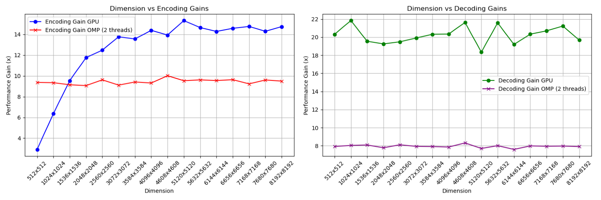

Figure 2.1: Comparison of Encoding Gain and Decoding Gain between GPU CUDA and OMP 

As shown in Figure 2.1, the encoding gain for the GPU compared to the CPU increases as the image dimensions grow. The encoding gain for OMP compared to the CPU remains consistent at around 9–10x. For decoding, the GPU achieves a gain of approximately 18–22x across all dimensions, while OMP achieves a decoding gain of about 8x. 

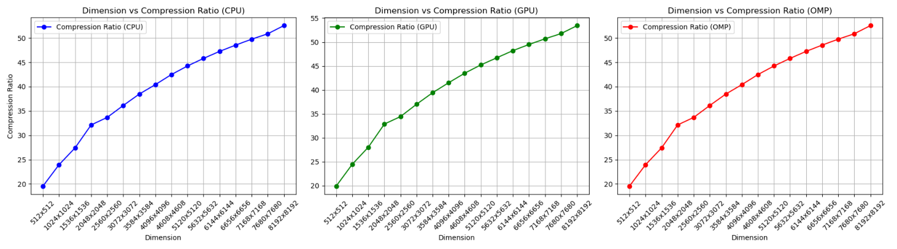

Figure 2.2: Comparison of Compression Ratio between CPU and CUDA 

As shown in Figure 2.1, the compression ratio for CPU, GPU, and OMP increases as the image dimensions grow. 

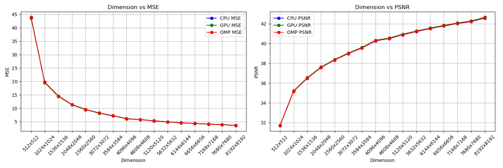

Figure 2.3: Comparison of MSE and PSNR between CPU and CUDA 

As shown in Figure 2.1, the MSE for CPU, GPU, and OMP decreases as the image dimensions grow. Meanwhile, the PSNR increases for CPU, GPU, and OMP with larger image dimensions. 

## 4.0 Discussion & Conclusion 

The results show that parallel computing techniques can greatly speed up JPEG image compression. The CUDA (GPU) implementation provided the highest performance improvement compared to the CPU, especially as the image dimensions increased. The OMP implementation consistently achieved a 9–10x speedup compared to the CPU. 

Despite the differences in execution times, all methods produced compressed images of similar quality. This is supported by the consistent MSE and PSNR values across all approaches, showing that the compressed images closely match the original images with minimal quality loss. 

In summary, for JPEG image compression, CUDA is the best choice when compatible hardware is available, offering the fastest performance as image sizes increase. OMP is a solid alternative for systems without GPUs, providing significant speed improvements in multi-core environments. 
